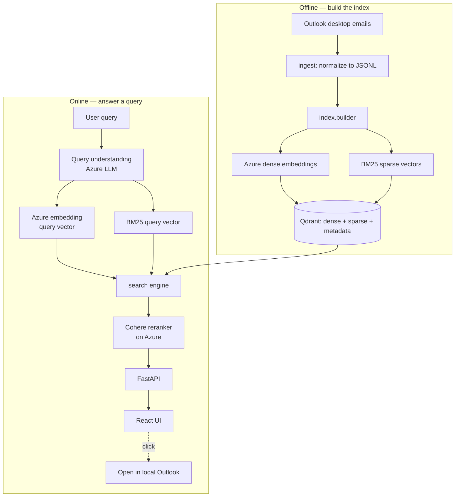
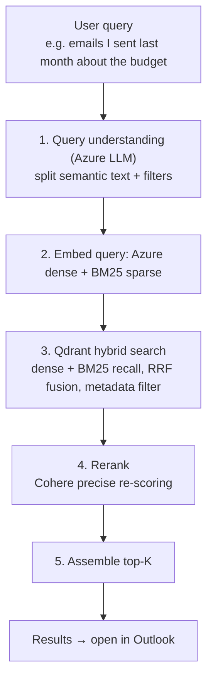

# Email Search

Natural-language semantic search over your own Outlook emails. Queries are
understood by an LLM, matched by **hybrid retrieval** (dense vectors + BM25
keywords) with server-side metadata filtering, and precisely re-ordered by a
Cohere reranker — so the right emails surface even when the wording does not
match exactly. It handles both Chinese and English, and intents like time
ranges and senders.

Built as a product, not a throwaway demo: an Azure OpenAI model computes
embeddings, a Qdrant vector database stores and serves them with hybrid
dense/sparse search, a Cohere reranker on Azure sharpens the ranking, and a
click opens the original message in the local Outlook desktop client.

## How it works

Two phases: an **offline** phase that indexes emails into Qdrant, and an
**online** phase that answers each query.



### Retrieval pipeline



| Stage | Responsibility | Component |
|-------|----------------|-----------|
| 1. Query understanding | Split semantic text from date/sender filters | Azure OpenAI chat model |
| 2. Embed query | Dense vector + BM25 sparse vector | Azure `text-embedding-3-large` (3072-dim) + FastEmbed `Qdrant/bm25` |
| 3. Recall + filter | Hybrid dense/sparse search, RRF fusion, pushed-down filters | Qdrant |
| 4. Rerank | Re-score the candidate pool precisely | Cohere rerank on Azure (local cross-encoder fallback) |
| 5. Assemble | Return top-K with per-stage scores | — |

Query understanding runs only on the query string (email content is never sent
to the chat model). If Azure is unavailable, the query degrades gracefully to a
plain semantic search with no structured filters.

### Why hybrid retrieval

Dense vectors excel at meaning (synonyms, paraphrases, cross-language) but blur
rare literal tokens — identifiers, codes, surnames, internal project names.
BM25 is the opposite: exact-term matching with no semantic understanding. Each
covers the other's blind spot, so Qdrant runs both recalls and fuses them with
Reciprocal Rank Fusion (RRF) entirely server-side. The BM25 vector uses
Qdrant's IDF modifier, so scoring is owned by the database. A controlled recall
probe (deterministic, no LLM or reranker) showed dense-only recall of rare
proper nouns at 32%; adding BM25 lifted it to 76% — exactly the literal-token
blind spot hybrid is meant to close.

### Why Qdrant

Full email bodies are not stored in the app — only vectors, metadata and a
short display snippet live in Qdrant; the full message opens in the local
Outlook client on click. Qdrant persists to disk, so the API starts instantly
without loading vectors into memory, and metadata filters (date range, sender
name) are pushed down to the database instead of being applied in Python.

### Reranking

A first pass recalls the top candidates by hybrid search; a reranker then
re-scores each candidate against the query for sharper ordering. The default is
Cohere rerank hosted on Azure AI Foundry — fast and CPU-free. If
`COHERE_RERANK_URL` is left empty, the system falls back to a local
`bge-reranker-v2-m3` cross-encoder.

## Project layout

```
backend/
  app/      config, schemas, Azure client, FastAPI app
  ingest/   read emails from Outlook -> normalized JSONL; open one in Outlook
  index/    Azure dense embedder, BM25 sparse embedder, Qdrant store, builder
  search/   Qdrant-backed hybrid engine + Cohere / local rerankers
  query/    Azure query understanding
  eval/     metrics (Recall@K, Precision@R, MRR, nDCG@K) + runner + qrels builder
  scripts/  Azure connectivity smoke test
frontend/   React + Vite search UI
data/       your emails (JSONL) — git-ignored
eval/       qrels + results report — git-ignored (real email subjects)
```

## Setup

### 1. Qdrant (Docker)

```powershell
docker run -d --name qdrant -p 6333:6333 -p 6334:6334 `
  -v "${PWD}\qdrant_storage:/qdrant/storage" qdrant/qdrant
```

### 2. Backend

```powershell
cd backend
python -m venv .venv
.\.venv\Scripts\Activate.ps1
pip install -r requirements.txt
copy .env.example .env   # then fill in Azure endpoint, key and deployments
```

Verify Azure connectivity:

```powershell
python -m scripts.test_azure
```

### 3. Frontend

```powershell
cd frontend
npm install
```

## Run end-to-end

1. Import your emails from the local Outlook desktop client (Windows), then
   build the index:

   ```powershell
   cd backend
   python -m ingest.outlook_com --limit 2000 --out ../data/emails.jsonl
   python -m index.builder --data ../data/emails.jsonl
   ```

   You can target a single folder instead of the whole mailbox:

   ```powershell
   python -m ingest.outlook_com --folder EmailSearch --out ../data/emails.jsonl
   ```

2. Start the API:

   ```powershell
   uvicorn app.main:app --reload --port 8000
   ```

3. Start the UI (separate terminal):

   ```powershell
   cd frontend
   npm run dev
   ```

   Open http://localhost:5173. Click any result to open the original email in
   your desktop Outlook.

## Evaluate search quality

Search quality is measured against a set of hand-labeled queries with graded
relevance (0 = irrelevant, 1 = relevant, 2 = highly relevant), covering Chinese
workplace topics, English technical work, time/sender filters, and exact-keyword
lookups.

```powershell
cd backend
python -m eval.run_eval --qrels ../eval/qrels.jsonl --k 10 --out ../eval/results.md
```

Reports four metrics, averaged over all queries:

| Metric | What it measures |
|--------|------------------|
| Recall@10 | Share of relevant emails found in the top 10 |
| Precision@R | Precision at rank R, where R = number of relevant emails (self-normalizing) |
| MRR | How high the first relevant result lands |
| nDCG@10 | Ranking quality with graded relevance |

Latest run over 22 labeled queries on real emails (deterministic query
understanding, `temperature=0`):

| Metric | Score |
|--------|-------|
| Recall@10 | 0.898 |
| Precision@R | 0.872 |
| MRR | 1.000 |
| nDCG@10 | 0.933 |

Running the evaluation writes a full per-query, per-category breakdown to
`eval/results.md` (kept out of version control, as it contains real email
subjects). To regenerate the labeled query set, edit the labels in
`backend/eval/build_qrels.py` and run `python -m eval.build_qrels`.

## Configuration

All settings live in `backend/.env` (git-ignored); see
[backend/.env.example](backend/.env.example) for the full list. Key values:

```
AZURE_OPENAI_ENDPOINT=https://<resource>.services.ai.azure.com/openai/v1
AZURE_OPENAI_API_KEY=...
AZURE_EMBED_DEPLOYMENT=text-embedding-3-large
AZURE_CHAT_DEPLOYMENT=gpt-4.1-mini

COHERE_RERANK_URL=https://<resource>.services.ai.azure.com/providers/cohere/v2/rerank
COHERE_RERANK_DEPLOYMENT=Cohere-rerank-v4.0-fast

QDRANT_URL=http://localhost:6333
QDRANT_COLLECTION=emails

ME_NAME=Your Name          # used to resolve "emails I sent" queries
```

## API

| Endpoint | Description |
|----------|-------------|
| `GET /api/health` | Index size and the active embedding / rerank / chat models |
| `GET /api/search?q=&top_k=` | Run a search; returns parsed query, filters and ranked hits |
| `POST /api/open?id=<EntryID>` | Open the email in the local Outlook desktop client |

